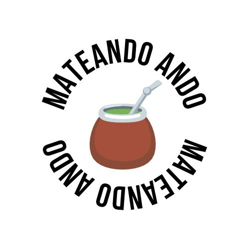

# Mateando Ando

Mateando Ando es un E-commerce que se dedica a la venta de productos para tomar mates. 

## Producto que vende Mateando Ando
* Mates
* Bombillas
* Termos
* Set Materas

## Logo de la web

 ## Propósito del proyecto
 Este proyecto es para el curso de React dictado por [CoderHouse](https://www.coderhouse.com/)
 Es mi primer E-commerce que realizo en React, en el cual utilice entre otras cosas:
 * Jsx
 * Componentes
 * API's
 * Eventos
 * Context
 * Firebase

## Dependencias instaladas: 
* [React-Bootstrap](https://react-bootstrap.github.io/)
* [React-router-dom](https://v5.reactrouter.com/)
* [React Icons](https://react-icons.github.io/react-icons/)
* [SweetAlert2](https://sweetalert2.github.io)

## Introducción sobre la instalación:

1. git clone https://github.com/Matiim/mateando_ando.git  
2. npm install

## Preview
podes visualizar el proyecto derectamente ingresando a este link https://mateando-ando.vercel.app/

